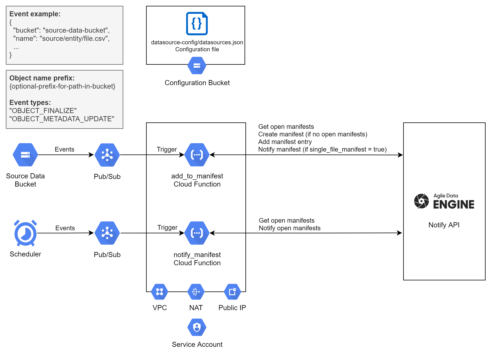

# Introduction
This repository contains a reference solution for notifying incoming source data files for Agile Data Engine Notify API (https://ade.document360.io/docs/notify-api) in Google Cloud Platform. 

**The repository is provided for reference purposes only and the solution may require modifications to fit your use case. Note that this solution is not part of the Agile Data Engine product. Please use at your own caution.**

**Contents:**
- Terraform templates for deploying required GCP resources
- Python functions for deploying Cloud Functions

# Notifier architecture & process
Reference Notifier solution for GCP:



## Notifying process

1. Source data files are created into a source data bucket by an external process (i.e. not Agile Data Engine nor the Notifier). This source data bucket is not part of the Notifier solution and must be managed separately.
2. Pub/Sub tracks OBJECT_FINALIZE and OBJECT_METADATA_UPDATE cloud events in the source data bucket and triggers the [add_to_manifest](functions/main.py) function.
3. The function gets the data source configuration file [datasource-config/datasources.json](configuration/datasources.json) from the configuration bucket and compares the event url to the configured data sources.
4. If the data source is identified, the function calls Notify API to search for open manifests for the data source.
5. If open manifests are found, the function will add the file to the latest open manifest.
6. If open manifests are not found, a new one will be created and the file added there.
7. If **single_file_manifest** is set to **true** for the data source in the [configuration file](configuration/datasources.json), the manifest will also be notified (closed).
8. Notification of data sources where **single_file_manifest** is set to **false** is done with the [notify_manifest](functions/main.py) function which is triggered by scheduler jobs. Scheduler jobs are configured in the [scheduler_jobs.tf](terraform/scheduler_jobs.tf) template.

# Dependencies
This solution uses the [adenotifier](https://github.com/solita/adenotifier) Python library. Please specify a version in [requirements.txt](functions/requirements.txt) to prevent issues with library upgrades.

# Deployment
## Prerequisites
### Deployment tools
1. Install [Google Cloud CLI](https://cloud.google.com/sdk/docs/install-sdk).
2. Install [Terraform](https://www.terraform.io/downloads). Note that the templates in this repository are created for Terraform v1.2.7 and GCP provider hashicorp/google-beta v4.31.0. Using other versions may require changes to the templates.
3. Login to GCP:
```Powershell
gcloud auth application-default login --project your-gcp-project-id
```

## GCP resources
1. Go through the [main Terraform template](terraform/main.tf), the [scheduler jobs template](terraform/scheduler_jobs.tf) and the [example variable values](terraform/variables.tf). Modify the templates according to your needs and policies, set values for variables.

2. Run terraform init to initialize the working directory:
```Powershell
cd terraform
terraform init
```

3. The templates use terraform workspaces to manage environments and resource naming. Create/select a workspace, for example:
```Powershell
terraform workspace new dev
terraform workspace select dev
```

4. Run terraform plan to preview deployment, check output:
```Powershell
terraform plan
```

5. Run deployment:
```Powershell
terraform apply
```

# Configuration
## Update the Notify API secret in the Secret Manager
The secret is deployed without a value. Add a new version in the Google Cloud console in the following format:
```JSON
{
	"base_url": "https://external-api.{environment}.datahub.{tenant}.saas.agiledataengine.com/notify-api",
	"api_key": "{your-api-key}",
	"api_key_secret": "{your-api-key-secret}"
}
```
Where:
* {tenant} is the SaaS tenant, e.g. s1234567.
* {environment} is the Runtime environment name, e.g. dev, test or prod.

Agile Data Engine support will provide the secrets.

## Provide the public IP addresses to Agile Data Engine support
Agile Data Engine support needs to add the public IP address to the allowed list before the deployed solution can connect to Notify API. If you have deployed multiple environments, provide IP addresses of each environment to the support team.

## Data source configuration
Configure data sources into the configuration file [datasources.json](configuration/datasources.json). The Terraform template deploys this to the configuration bucket to path **datasource-config/datasources.json**. See specifications for the configuration format in the [adenotifier library readme](https://github.com/solita/adenotifier). Additionally, configure the following attributes for each data source. They are used for identifying the data source:

| Attribute  | Mandatory | Description |
| --- | --- | --- |
| storage_bucket  | x | Storage bucket name where the source file is located. |
| folder_path  | x | Folder path to the source file. |
| file_extension  | | Optional: File extension of the source file. |

See configuration examples in [configuration/datasources.json](configuration/datasources.json).

## Scheduler jobs
Notification of manifests of data sources where **single_file_manifest** is set to **false** must be scheduled with Cloud Scheduler jobs. Otherwise files would only be collected to manifests, but the manifests would never be closed and loaded by Agile Data Engine. Define scheduler jobs in the [Terraform template](terraform/scheduler_jobs.tf).

# Notes
OBJECT_METADATA_UPDATE events are tracked to enable re-notifying files with simple metadata changes, e.g. by updating a metadata timestamp.